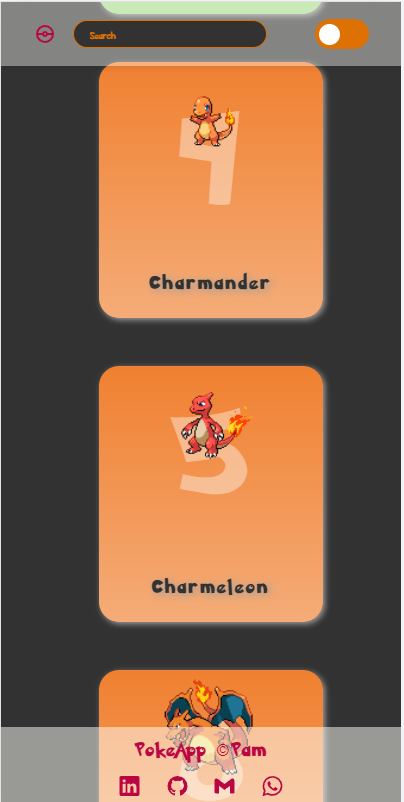

# Pokemon app

What it says. An app using the pokeapi to display all the pokemons, with infinite scroll, flipcard, dark mode, and a search all pokemon function.

## How to start

As with any react app, just go for:

### npm i

and then, 
### `npm start`

## The stack
Something really simple, at least for now:
- typescript
- styled-components
- axios

What makes this project different, then? well, I used it to test chat-gpt, asking it for refactorings, color palettes and the sort. I'm still testing its limits so it's very fun!

## Screenshots

## Vercel

pokemon-app-alhanampi.vercel.app